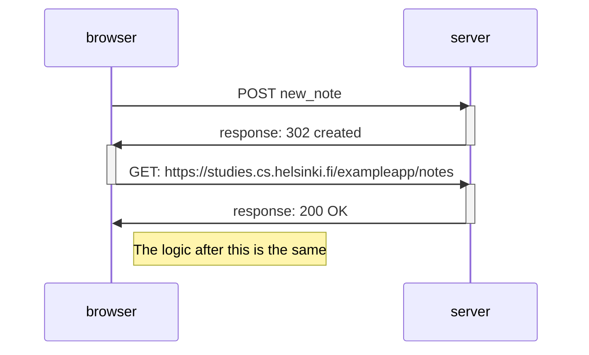

```mermaid
sequenceDiagram
    participant browser
    participant server

    browser->>server: POST new_note
    activate server
    server->>browser: response: 302 created
    deactivate server
    activate browser
    browser->>server: GET: https://studies.cs.helsinki.fi/exampleapp/notes
    deactivate browser
    activate server
    server->>browser: response: 200 OK
    deactivate server
    Note right of browser: The logic after this is the same

    
```